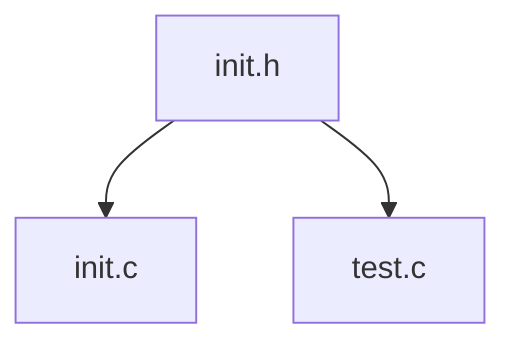

# Secundus Partum

## 소개

GSM 코딩 대회와 연계되는 **C 프로젝트**이다. 이 프로젝트는 프로그래밍 수행평가 이후에 점수화되어 공개 발표 여부가 결정될 것이다.

## 프로젝트 상태

1. [~ 10/31] 프로젝트 계획서 제출
2. [11/1 ~] 개발 시작

## 코드 구조

## 아이디어
> DOS 창 디자인(graphics.h, conio.h, windows.h 등 사용)

> 실생활 용품 구현하기(자판기, 신호등 등)

> 추가 예정
